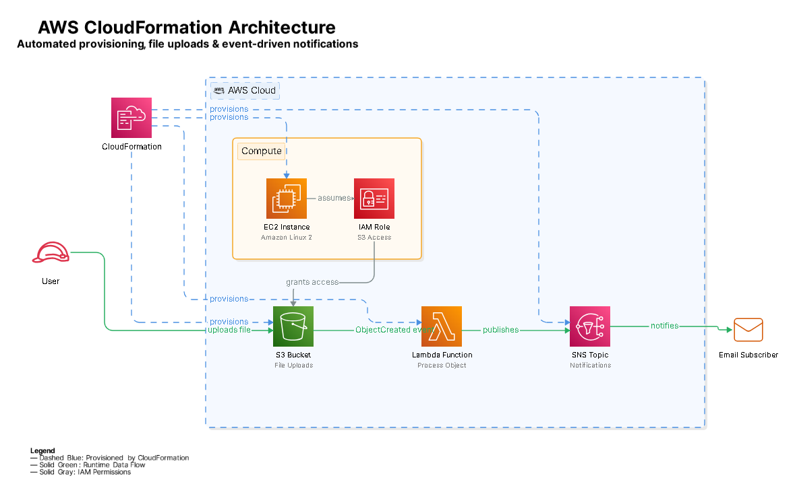

# Automated AWS Infrastructure via CloudFormation

This repository contains a fully functional AWS CloudFormation template that automates the deployment of a secure compute instance alongside an event-driven serverless notification pipeline.

---

## System Architecture

The entire infrastructure lifecycle, permissions matrix, and runtime event flow are mapped out in the diagram below:

### Structural Breakdown & Data Flow

As detailed in the `architecture2.png` specification, the system is segmented into three distinct logical layers:

1. **Provisioning Layer (Dashed Blue):** AWS CloudFormation automatically builds and connects all core components from scratch, ensuring repeatable environments.
2. **Access Control Layer (Solid Gray):** The compute block features an **EC2 Instance** that securely assumes an **IAM Role**. This role safely grants necessary access privileges directly to the **S3 Bucket** without embedding static credentials.
3. **Runtime Event Pipeline (Solid Green):** 
   * A **User** uploads a file into the **S3 Bucket**.
   * The bucket immediately generates an `ObjectCreated` event, instantly triggering the **Lambda Function**.
   * The serverless function parses the file metadata and **publishes** a payload to the **SNS Topic**.
   * The SNS Topic broadcasts the system update to the registered **Email Subscriber**.

---

## Technology Stack & Resources

| Service Component | AWS Resource Type | Functional Role |
| :--- | :--- | :--- |
| **AWS CloudFormation** | `Infrastructure as Code (IaC)` | Defines, creates, and connects the absolute stack state. |
| **AWS EC2** | `AWS::EC2::Instance` | Hosted compute platform assigned an identity profile. |
| **AWS IAM** | `AWS::IAM::Role` | Executes minimal-privilege safety controls between instances and buckets. |
| **AWS S3** | `AWS::S3::Bucket` | High-durability object storage acting as our primary ingestion engine. |
| **AWS Lambda** | `AWS::Lambda::Function` | Python-backed compute event handler processing file alerts. |
| **AWS SNS** | `AWS::SNS::Topic` | Pub/Sub messaging hub that broadcasts notifications to email endpoints. |

---

## Repository Contents

* `template.yaml` — The master CloudFormation script defining resources, access constraints, parameters, and outputs.
* `architecture2.png` — The comprehensive structural and data flow architecture diagram.

---

## Deployment Instructions

### Prerequisites
* A valid, active AWS Account.
* An active email address to catch real-time pipeline alerts.

### Setup Steps
1. Download the `template.yaml` file from this repository.
2. Open your **AWS Management Console** and head over to **CloudFormation**.
3. Choose **Create stack** (with new resources).
4. Opt for **Upload a template file**, upload your local copy of `template.yaml`, and hit **Next**.
5. Give your stack a recognizable name and supply your email into the `NotificationEmail` parameter field.
6. Advance through the configuration screens. At the final review step, **check the box authorizing CloudFormation to generate IAM resources with custom names**, then click **Submit**.

---

## How to Test the Infrastructure

1. **Confirm the SNS Subscription:** Check the inbox of the email address provided at launch. Look for an automated validation note sent by AWS SNS and select **Confirm Subscription**.
2. **Trigger an Ingestion Event:** Navigate to the **S3 Console**, find your new bucket (`project-s3-bucket-[account-id]-[region]`), and upload a random file (such as a text document or an image).
3. **Verify Notification Delivery:** Check your email client again within a few seconds. You will have a structured alert delivered straight from your serverless pipeline highlighting the precise bucket and file key you just uploaded.
